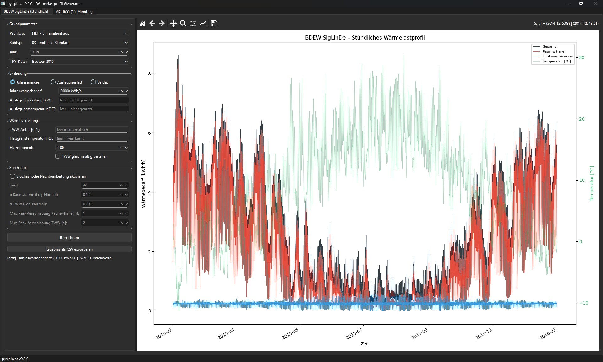
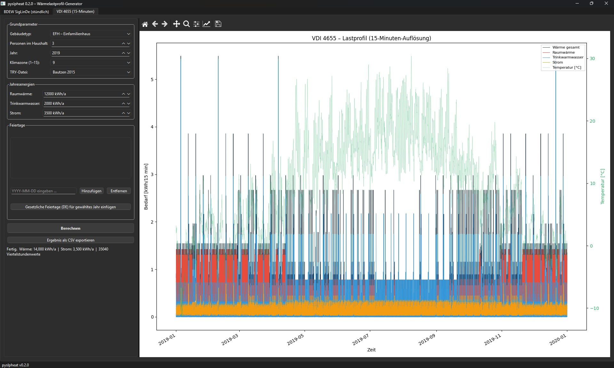

# pyslpheat – Documentation

Load profile generation for district heating simulations.
Implements two German standards: **BDEW** (hourly, climate-dependent) and **VDI 4655** (15-min, day-type based).

---

## Table of Contents

1. [Installation & quick start](#installation--quick-start)
2. [BDEW module](#bdew-module)
   - [Standard call](#standard-call)
   - [Return value](#return-value)
   - [Profile types](#profile-types)
   - [Configuration options](#configuration-options)
     - [DHW share](#dhw-share-dhw_share)
     - [Heating limit temperature](#heating-limit-temperature-heating_limit_temp)
     - [Heating exponent](#heating-exponent-heating_exponent)
     - [Flat DHW distribution](#flat-dhw-distribution-dhw_flat)
     - [Scaling modes](#scaling-modes-peak_design_kw--design_temperature)
     - [Stochastic post-processing](#stochastic-post-processing)
3. [VDI 4655 module](#vdi-4655-module)
   - [Standard call](#standard-call-1)
   - [Return value](#return-value-1)
   - [Parameters](#parameters)
   - [Day-type classification](#day-type-classification)
4. [TRY weather data](#try-weather-data)
5. [References](#references)

---

## Installation & quick start

```bash
pip install .          # from the package root
# or editable install during development:
pip install -e .

# with GUI (PyQt6 desktop application):
pip install ".[gui]"
```

```python
from pyslpheat import bdew_calculate, vdi4655_calculate
```

**GUI – no scripting required**

```bash
pyslpheat-gui          # launches the desktop application
```

The application covers the complete parameter set of both modules.
See [README.md](../README.md) for details.

---

## BDEW module

`bdew.calculate()` — also importable as `bdew_calculate` from the top-level package.

Implements the **SigLinDe** methodology from the *BDEW/VKU/GEODE guideline* for
temperature-dependent standard load profiles of residential and commercial buildings.

### Standard call

```python
from pyslpheat import bdew_calculate, TRY_BAUTZEN_2015

df = bdew_calculate(
    annual_heat_kWh = 20_000,          # annual heat demand [kWh/a]
    profile_type    = "HMF",           # building class (e.g. "HMF", "HEF", "GKO" …)
    subtype         = "03",            # subtype within class
    TRY_file_path   = TRY_BAUTZEN_2015,
    year            = 2026,
)
```

That's it for a deterministic profile at BDEW standard settings.

### Return value

A `pd.DataFrame` with an hourly `DatetimeIndex` (8 760 rows for non-leap years):

| Column | Unit | Description |
|---|---|---|
| `Q_heat_kWh` | kWh/h | Space heating demand |
| `Q_dhw_kWh` | kWh/h | Domestic hot water demand |
| `Q_total_kWh` | kWh/h | Total heat demand |
| `temperature_C` | °C | Hourly outside temperature from TRY |

```python
df["Q_total_kWh"].sum()   # → approx. annual_heat_kWh
df["Q_total_kWh"].max()   # → design peak load
```

---

### Profile types

All valid `profile_type` / `subtype` combinations, sourced directly from `data/bdew/daily_coefficients.csv`:

| `profile_type` | Available `subtype` values | Description |
|---|---|---|
| `"HEF"` | `"03"` `"04"` `"05"` `"33"` `"34"` | Single-family residential |
| `"HMF"` | `"03"` `"04"` `"05"` `"33"` `"34"` | Multi-family residential |
| `"GKO"` | `"01"` `"02"` `"03"` `"04"` `"05"` `"33"` `"34"` | Small commercial / public buildings |
| `"GHA"` | `"01"` `"02"` `"03"` `"04"` `"05"` `"33"` `"34"` | Retail trade |
| `"GMK"` | `"01"` `"02"` `"03"` `"04"` `"05"` `"33"` `"34"` | Metal working / automotive |
| `"GBD"` | `"01"` `"02"` `"03"` `"04"` `"05"` `"33"` `"34"` | Office services |
| `"GBH"` | `"01"` `"02"` `"03"` `"04"` `"05"` `"33"` `"34"` | Accommodation / hotels |
| `"GWA"` | `"01"` `"02"` `"03"` `"04"` `"05"` `"33"` `"34"` | Laundry / textile |
| `"GGA"` | `"01"` `"02"` `"03"` `"04"` `"05"` `"33"` `"34"` | Catering / restaurants |
| `"GBA"` | `"01"` `"02"` `"03"` `"04"` `"05"` `"33"` `"34"` | Bakeries |
| `"GGB"` | `"01"` `"02"` `"03"` `"04"` `"05"` `"33"` `"34"` | Wholesale trade / distribution |
| `"GPD"` | `"01"` `"02"` `"03"` `"04"` `"05"` `"33"` `"34"` | Paper / printing |
| `"GMF"` | `"01"` `"02"` `"03"` `"04"` `"05"` `"33"` `"34"` | Mixed / miscellaneous commercial |
| `"GHD"` | `"03"` `"04"` `"33"` `"34"` | General commercial aggregate (Gewerbe/Handel/Dienstleistungen) |

**Subtype numbering convention:**

- `"01"`–`"05"` — five building variants ordered by increasing insulation quality (01 = lowest, 05 = best). Only available for commercial `G*` types; residential types start at `"03"`.
- `"33"` / `"34"` — variants with an additional **linear temperature correction** on top of the sigmoid (non-zero `mH`, `bH`, `mW`, `bW` coefficients). Use these for buildings where heat demand also has a significant linear dependence on outside temperature, e.g. poorly sealed industrial halls.
- `"GHD"` only has subtypes `"03"`, `"04"`, `"33"`, `"34"` — the `"01"`, `"02"`, `"05"` variants are not defined in the BDEW guideline for this aggregate type.

---

### Configuration options

#### DHW share (`dhw_share`)

```python
df = bdew_calculate(..., dhw_share=0.25)
```

Overrides the DHW fraction of the total annual heat demand.
Without this parameter the split is taken directly from the BDEW sigmoid
coefficients, which varies by profile type (typically 20–35 %).

- `dhw_share=0.25` → DHW is forced to exactly 25 % of `annual_heat_kWh`.
- Space heating is scaled correspondingly so the annual total is preserved.
- Set to `None` (default) to use the BDEW-native split.

---

#### Heating limit temperature (`heating_limit_temp`)

```python
df = bdew_calculate(..., heating_limit_temp=15.0)
```

Sets a **heating limit temperature (Heizgrenztemperatur)** [°C].
On any day where the *allocation temperature* (BDEW 4-day weighted average)
exceeds this threshold, the space heating demand is set to zero.
DHW is unaffected.

| Value | Effect |
|---|---|
| `None` (default) | No limit — heating follows the sigmoid for all temperatures |
| `15.0` | Standard heating limit temperature (DIN EN 12831 reference) |
| `12.0` | More aggressive cut-off, larger summer zero-load period |

> **Note:** The annual energy target `annual_heat_kWh` is always met exactly.
> When warm days are zeroed, the normalization factor `KW` is recalculated on
> the remaining heating days so they scale up accordingly.

---

#### Heating exponent (`heating_exponent`)

```python
df = bdew_calculate(..., heating_exponent=1.5)
```

Applies a **power-law reshaping** to the daily heating distribution after all
other shaping steps.  Annual heating sum is always preserved by renormalization.

```
daily_demand_shaped = daily_demand ^ exponent
daily_demand_shaped *= original_annual_sum / shaped_annual_sum
```

| Value | Effect |
|---|---|
| `1.0` (default) | Standard BDEW shape (no change) |
| `> 1` | Sharper winter peaks, longer near-zero summer periods (useful if measured building has higher temperature sensitivity than BDEW average) |
| `< 1` | Flatter profile, smaller peak-to-base ratio |

Combine with `heating_limit_temp` to get the sharpest winter peak:

```python
df = bdew_calculate(..., heating_limit_temp=12.0, heating_exponent=1.5)
```

---

#### Flat DHW distribution (`dhw_flat`)

```python
df = bdew_calculate(..., dhw_flat=True)
```

By default DHW follows the same hourly factors as space heating (BDEW BGW table,
temperature and weekday dependent).  With `dhw_flat=True` the daily DHW energy
is distributed uniformly across 24 hours (1/24 per hour).

Useful when:
- The DHW system has a large buffer storage that decouples generation from demand.
- Only the daily DHW energy profile matters, not the intraday shape.

---

#### Scaling modes (`peak_design_kW` + `design_temperature`)

The module supports three mutually compatible scaling modes:

##### Mode A – Annual energy only (default)

```python
df = bdew_calculate(annual_heat_kWh=20_000, ...)
```

`KW` (BDEW normalisation constant) is solved so that
`sum(profile) = annual_heat_kWh`. Profile shape is purely BDEW-standard.

---

##### Mode B – Design load only

```python
df = bdew_calculate(
    annual_heat_kWh  = None,
    peak_design_kW   = 13.0,    # [kW] design heating power
    design_temperature = -12.4, # [°C] design outside temperature
    ...
)
```

`KW` is set so that the **daily mean heating power at `design_temperature`**
equals `peak_design_kW`. The annual energy is a **derived output** — read it
from `df["Q_heat_kWh"].sum()`.

Use this when you know the installed boiler/heat pump size but not the annual
consumption.

---

##### Mode C – Both annual energy and design load (recommended for networks)

```python
df = bdew_calculate(
    annual_heat_kWh    = 20_000,
    peak_design_kW     = 13.0,
    design_temperature = -12.4,
    ...
)
```

Both constraints are satisfied simultaneously by finding the exponent `β` such
that the power-law shaped heating profile `h^β` meets:

```
KW · h_design^β = peak_design_kW · 24       (design-day condition)
KW · (Σ h^β · F_D + Σ h_dhw · F_D) = annual_heat_kWh   (annual condition)
```

`β > 1` means the building has higher temperature sensitivity than the BDEW
average (steeper heating curve); `β < 1` means flatter.
This mode is most useful for district heating network sizing: it honours both
the measured annual meter reading and the calculated design load.

---

#### Stochastic post-processing

```python
df = bdew_calculate(
    ...,
    stochastic              = True,
    stochastic_seed         = 42,       # None for different result each run
    stochastic_sigma_sh     = 0.12,     # log-normal σ for space heating (~12%)
    stochastic_sigma_dhw    = 0.20,     # log-normal σ for DHW (~20%)
    stochastic_max_shift_sh = 1,        # ±hours daily peak shift, space heating
    stochastic_max_shift_dhw= 2,        # ±hours daily peak shift, DHW
)
```

Two independent manipulations are applied **after** all deterministic shaping,
in this order:

**Step 1 – Peak jitter** (`max_shift_*`)
Each day's hourly profile is shifted circularly by a uniformly random integer
in `[-max_shift, +max_shift]` hours. Space heating and DHW are shifted
independently because DHW peaks are more behaviour-driven.
Daily energy sums are preserved (circular shift, no clipping).

**Step 2 – Log-normal amplitude noise** (`sigma_*`)
Each hour is multiplied by a log-normal factor with `μ=0` in log-space.
Hours that are exactly zero (summer nights without heating) are kept at zero.
The annual sum is renormalized to the original value after the noise is applied,
so **energy balance is always exact**.

Higher `sigma_dhw` than `sigma_sh` is appropriate because DHW is
behaviour-driven and has more day-to-day variability than climate-driven
space heating.

> **Why stochastic?** BDEW profiles are statistical averages — all days with
> similar temperature produce near-identical curves. Stochastic post-processing
> adds realistic day-to-day variability for network transient simulations
> without violating the annual energy constraint.

---

## VDI 4655 module

`vdi4655.calculate()` — also importable as `vdi4655_calculate` from the top-level package.

Implements the **VDI 4655 (May 2008)** reference load profile method for
residential buildings. Profiles are based on 10 discrete **day types**
classified by season, weekday type, and cloud cover.

### Standard call

```python
import numpy as np
from pyslpheat import vdi4655_calculate

holidays = np.array([
    "2026-01-01", "2026-04-03", "2026-04-06",
    "2026-05-01", "2026-05-14", "2026-05-25",
    "2026-10-03", "2026-12-25", "2026-12-26",
], dtype="datetime64[D]")

df = vdi4655_calculate(
    annual_heating_kWh     = 15_000,
    annual_dhw_kWh         =  5_000,
    annual_electricity_kWh =  4_000,   # required by VDI 4655
    building_type          = "MFH",
    number_people_household= 4,
    year                   = 2026,
    climate_zone           = "9",
    TRY                    = "path/to/TRY.dat",
    holidays               = holidays,
)
```

### Return value

A `pd.DataFrame` with a **15-minute** `DatetimeIndex` (35 040 rows):

| Column | Unit | Description |
|---|---|---|
| `Q_heat_kWh` | kWh/15min | Space heating |
| `Q_dhw_kWh` | kWh/15min | Domestic hot water |
| `Q_total_kWh` | kWh/15min | Total heat |
| `Q_electricity_kWh` | kWh/15min | Electricity |
| `temperature_C` | °C | Hourly TRY temperature (repeated ×4) |

Resample to hourly for further processing:
```python
df_hourly = df[["Q_heat_kWh", "Q_dhw_kWh", "Q_total_kWh"]].resample("h").sum()
```

### Parameters

| Parameter | Type | Description |
|---|---|---|
| `annual_heating_kWh` | float | Annual space heating demand [kWh/a] |
| `annual_dhw_kWh` | float | Annual DHW demand [kWh/a] |
| `annual_electricity_kWh` | float | Annual electricity demand [kWh/a] — required by the VDI 4655 day-type scaling, included in output |
| `building_type` | `"EFH"`, `"MFH"`, `"B"` | Single-family, multi-family, office |
| `number_people_household` | int | Number of occupants (EFH) or dwelling units (MFH) — scales the day-type energy factors |
| `year` | int | Calculation year |
| `climate_zone` | str `"1"`–`"15"` | DWD climate zone; zone 9 = central Germany |
| `TRY` | str | Path to DWD TRY `.dat` file (provides temperature and cloud cover) |
| `holidays` | `np.ndarray[datetime64[D]]` | Public holiday dates → treated as Sundays in day-type classification |

### Day-type classification

Each day is classified into one of 10 type codes by combining three criteria:

| Criterion | Values | Condition |
|---|---|---|
| **Season** (Jahreszeit) | `W` (winter), `Ü` (transition), `S` (summer) | Daily mean temp: `< 5 °C` / `5–15 °C` / `> 15 °C` |
| **Day type** | `W` (workday), `S` (weekend/holiday) | ISO weekday ≤ 5 and not a holiday |
| **Cloud cover** | `H` (clear, < 4 oktas), `B` (overcast, ≥ 4 oktas), `X` (summer, n/a) | Daily mean cloud cover from TRY; always `X` in summer |

Examples: `WWH` (winter workday, clear), `SWX` (summer workday), `ÜSB` (transition weekend, overcast).

Each day type has a **daily energy factor** (`F_heiz,TT`, `F_TWW,TT`, `F_el,TT`) from
`Faktoren.csv` that scales the annual energy onto the specific day.
The intraday shape comes from the 96-interval profile CSV files
(`MFH<DayType>.csv` etc.).

> **Limitation:** VDI 4655 is a step-profile method — all days of the same type
> are identical. There is no temperature-continuous interpolation like BDEW.
> For smooth climate-following profiles prefer BDEW; for standard-compliant
> residential profiles use VDI 4655.

---

## TRY weather data

Both modules require a **DWD Test Reference Year** (TRY) `.dat` file, providing
8 760 hourly rows of meteorological data for a full year.

- **Source:** [DWD / BBSR Test Reference Years](https://www.bbsr.bund.de/BBSR/DE/forschung/programme/zb/Auftragsforschung/5EnergieKlimaBauen/2013/testreferenzjahre/01-start.html)
- **Format:** fixed-width text, header block ends with a line starting `***`, then one row per hour
- Column index 5 = air temperature `t [°C]`
- Column index 9 = cloud cover `N [oktas]` (VDI 4655 only)

### Bundled station – Bautzen

pyslpheat ships six TRY files for DWD station **Bautzen** in `data/try/`:

| Constant | File | Description |
|---|---|---|
| `TRY_BAUTZEN_2015` | `TRY2015_…_Jahr.dat` | Present climate – average year |
| `TRY_BAUTZEN_2015_WINTER` | `TRY2015_…_Wint.dat` | Present climate – extreme cold winter |
| `TRY_BAUTZEN_2015_SUMMER` | `TRY2015_…_Somm.dat` | Present climate – extreme hot summer |
| `TRY_BAUTZEN_2045` | `TRY2045_…_Jahr.dat` | Future scenario (2045) – average year |
| `TRY_BAUTZEN_2045_WINTER` | `TRY2045_…_Wint.dat` | Future scenario (2045) – extreme cold winter |
| `TRY_BAUTZEN_2045_SUMMER` | `TRY2045_…_Somm.dat` | Future scenario (2045) – extreme hot summer |

The extreme files let you bracket design cases: the winter file drives maximum
heating peak load; the summer file drives minimum heating (and maximum cooling)
load. Comparing all three variants of the same climate epoch tests robustness
of a network design.

```python
from pyslpheat import (
    bdew_calculate,
    TRY_BAUTZEN_2015,
    TRY_BAUTZEN_2015_WINTER,
    TRY_BAUTZEN_2015_SUMMER,
)

scenarios = {
    "avg":    TRY_BAUTZEN_2015,
    "winter": TRY_BAUTZEN_2015_WINTER,
    "summer": TRY_BAUTZEN_2015_SUMMER,
}
for label, try_path in scenarios.items():
    df = bdew_calculate(annual_heat_kWh=20_000, profile_type="HMF", subtype="03",
                        TRY_file_path=try_path, year=2015)
    print(f"{label:6s}  peak={df['Q_total_kWh'].max():.1f} kWh/h")
```

### TRY filename encoding

The numeric part of a TRY filename encodes the **WGS 84 coordinates** of the
measurement station:

```
TRY2015_511676144222_Jahr.dat
         ──────────
         511676  144222
         └─lat─┘ └─lon─┘
         51.1676°N  14.4222°E   →  Bautzen, Saxony
```

Split rule: first 6 digits = latitude (2 integer + 4 decimal), last 6 digits =
longitude (2 integer + 4 decimal).

> **Climate zone:** Bautzen is in DWD climate zone **9** (central/eastern Germany).

---

## GUI – Desktop-Anwendung

pyslpheat enthält eine grafische Oberfläche (PyQt6), die den vollständigen
Parametersatz beider Module ohne Scripting zugänglich macht.

### Installation & Start

```bash
pip install ".[gui]"   # PyQt6 + matplotlib werden mitinstalliert
pyslpheat-gui
```

### BDEW SigLinDe-Tab



Alle Parameter aus `bdew_calculate()` sind einstellbar: Profiltyp, Subtyp,
Skalierungsmodus (Jahresenergie / Auslegungslast / Beides), Wärmeverteilung
(TWW-Anteil, Heizgrenztemperatur, Heizexponent, flache TWW-Verteilung) und
stochastische Nachbearbeitung (Seed, σ-Werte, max. Peak-Verschiebung).

### VDI 4655-Tab



Alle Parameter aus `vdi4655_calculate()` sind einstellbar: Gebäudetyp,
Personenzahl, Jahr, Klimazone, Jahresenergien für Raumwärme, TWW und Strom.
Feiertage können manuell eingegeben oder per Knopfdruck als gesetzliche
deutsche Feiertage für das gewählte Jahr automatisch befüllt werden.

### Gemeinsame Funktionen

- TRY-Auswahl: alle sechs gebündelten Bautzen-Dateien per Dropdown, plus
  Dateibrowser für eigene TRY-Dateien
- Eingebetteter Matplotlib-Plot mit Navigationstoolbar (Zoom, Pan, Speichern)
- CSV-Export der Ergebnisse (Semikolon-getrennt, Dezimalkomma)
- Berechnung läuft im Hintergrund-Thread — kein GUI-Freeze bei langen Läufen

---

## References

### BDEW module

**BDEW/VKU/GEODE (2025)**
*Leitfaden — Abwicklung von Standardlastprofilen Gas*, Berlin, 28.10.2025.
Defines the SigLinDe sigmoid + linear daily demand formula and the coefficient
table for all residential (HEF, HMF) and commercial (G-type) profile classes.
→ Coefficient data extracted into `data/bdew/daily_coefficients.csv`.

**FfE München (July 2015)**
*Weiterentwicklung des Standardlastprofilverfahrens Gas*
Underlying method for subtypes 33/34 with non-zero linear correction terms
(`mH`, `bH`, `mW`, `bW`).

**BGW/DVGW (August 2006)**
*Anwendung von Standardlastprofilen zur Belieferung nichtleistungsgemessener Kunden*
Hourly shape factors (Stundenfaktoren) by temperature class and weekday type.
→ Extracted into `data/bdew/hourly_coefficients.csv`.

### VDI 4655 module

**VDI 4655 (July 2021)**
*Referenzlastprofile von Wohngebäuden für Strom, Heizung und Trinkwarmwasser sowie Referenzerzeugungsprofile für Fotovoltaikanlagen*
Defines the day-type classification (season × weekday × cloud cover),
daily energy factors `F_heiz,TT`, `F_TWW,TT`, `F_el,TT`, and the
quarter-hourly intraday load profiles.
→ Day-type profiles in `data/vdi4655/load_profiles/`;
daily factors in `data/vdi4655/Faktoren.csv`.

### TRY weather data

**DWD / BBSR (July 2017)**
*Handbuch - Ortsgenaue Testreferenzjahre von Deutschland für mittlere, extreme und zukünftige Witterungsverhältnisse*
Provides the hourly meteorological data (temperature, cloud cover, radiation)
used for day-type classification and profile temperature-scaling.
→ Bundled TRY files for Bautzen in `data/try/`; further files available from
[DWD / BBSR](https://www.bbsr.bund.de/BBSR/DE/forschung/programme/zb/Auftragsforschung/5EnergieKlimaBauen/2013/testreferenzjahre/01-start.html).
